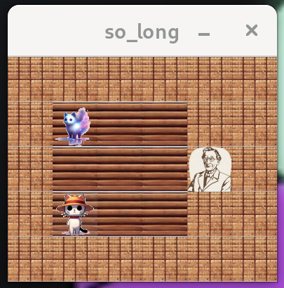
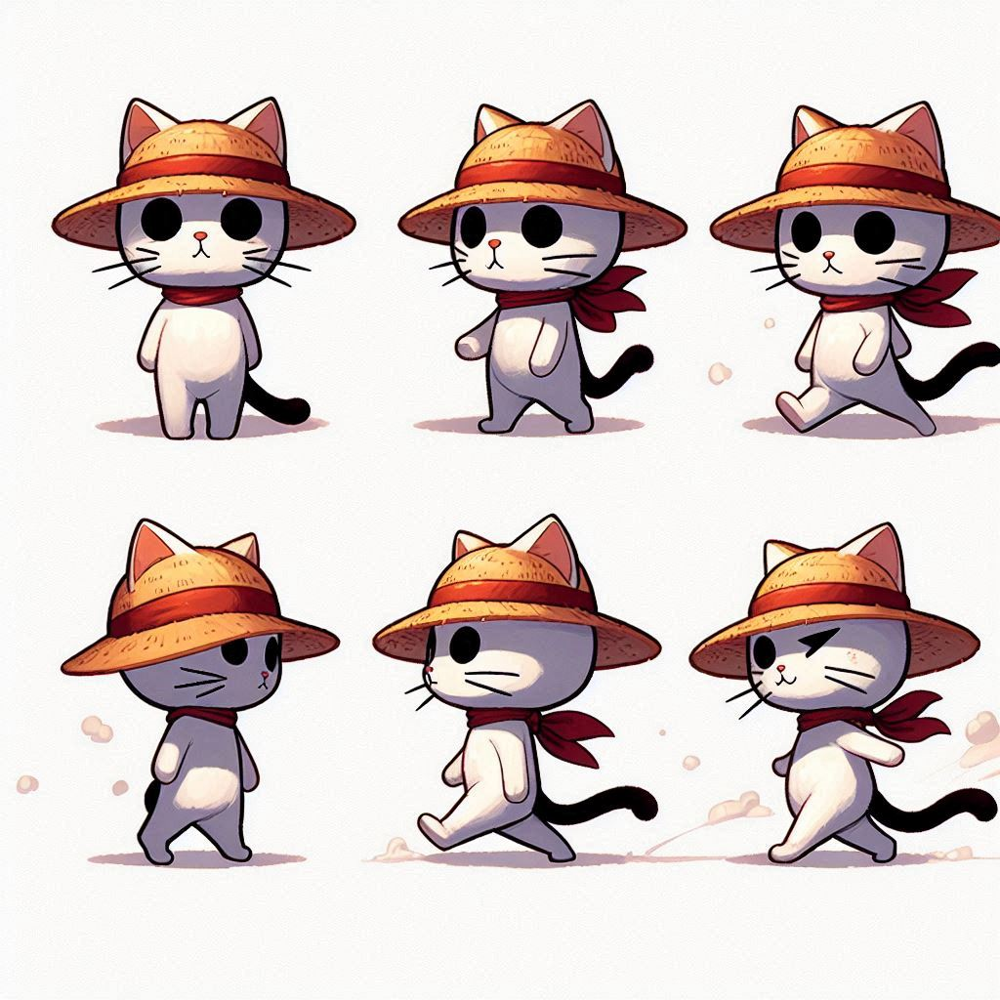

# so_long


## 📋 Project Overview

`so_long` is a 2D top-down game built with the MLX42 graphics library. This project is part of the 42 Common Core curriculum (Rank 02) and focuses on graphics programming, event handling, and game development fundamentals in C.

## 🎯 Objectives

- Create a 2D game using the MLX42 graphics library
- Implement map parsing and validation
- Handle player movement and game mechanics
- Manage textures, sprites, and rendering
- Implement collision detection and game logic
- Follow 42 School's coding standards (Norminette)

## 🎮 Game Mechanics

### Map Elements
| Character | Element | Description |
|-----------|---------|-------------|
| `1` | Wall | Impassable barriers |
| `0` | Floor | Walkable empty space |
| `P` | Player | Starting position (must be exactly 1) |
| `C` | Collectible | Items to collect (at least 1) |
| `E` | Exit | Game exit (must be exactly 1) |

### Game Rules
- **Objective**: Collect all collectibles (`C`) and reach the exit (`E`)
- **Movement**: Use WASD or arrow keys to move the player
- **Win Condition**: Collect all items before exiting
- **Movement Counter**: Display move count in terminal
- **Map Requirements**: Rectangular, surrounded by walls, valid path to all elements


# SO_LONG



## Descripción

so_long es un proyecto de juego 2D del currículo de 42. Enseña a los estudiantes sobre el desarrollo de juegos utilizando C y la biblioteca gráfica MLX42. El objetivo es navegar por un mapa, recoger todos los coleccionables y llegar a la salida en la menor cantidad de movimientos posible. El juego debe validar mapas, gestionar movimientos del jugador y renderizar el estado del juego usando MLX42.

## Dependencias

Este proyecto requiere la biblioteca **MLX42**. Puedes encontrar las instrucciones de instalación en su repositorio de GitHub: MLX42.

## Instalación

1. Clona este repositorio
2. Instala MLX42 siguiendo sus instrucciones.
3. Asegúrate de tener make y gcc instalados.

## Uso

1. Selecciona un tema: El juego incluye tres temas gráficos: fbaa_img, zombie_img y schrodinger_img. Para usar un tema, renombra la carpeta correspondiente a img. Asegúrate de que solo una carpeta se llame img a la vez. Por ejemplo:
	* Para el tema fbaa: mv fbaa_img img
	* Para el tema zombie: mv zombie_img img
	* Para el tema schrodinger: mv schrodinger_img img
2. Compila el proyecto: Ejecuta make para generar el ejecutable.
3. Ejecuta el juego: Usa ./so_long maps/map.ber, reemplazando map.ber con el archivo de mapa deseado de la carpeta maps.
4. Limpieza:
	* make clean para eliminar archivos objeto.
	* make fclean para eliminar el ejecutable y archivos objeto.
	* make re para recompilar todo (equivalente a make fclean && make all).

## Jugabilidad

* Controles: Usa las teclas de flecha o WASD para mover al jugador hacia arriba, abajo, izquierda o derecha.
* Objetivo: Recoge todos los coleccionables (representados por C en el mapa) antes de poder salir por la salida (representada por E).
* Conteo de movimientos: El número de movimientos se muestra en la terminal.
* Salir del juego: Presiona ESC o cierra la ventana.
* Mapas: Los mapas deben estar en formato .ber y ubicarse en la carpeta maps. Para jugar, ejecuta *./so_long maps/level_1_5.ber*.

## Temas

El juego soporta tres temas gráficos, aunque no sean lo más aesthetic del mundo, cada uno con imágenes en formato PNG:

* fbaa: Tema con gráficos personalizados con inspiración en De Sangre y Cenizas.
* zombie: Tema con gráficos de estilo zombie.
* schrodinger: Tema con gráficos inspirados en el gato de schrödinger.

Para cambiar de tema, renombra la carpeta deseada a img.

_NOTA:_ Se incluye referencia a One Piece.

## Solución de problemas

* Error de imágenes faltantes: Asegúrate de que una de las carpetas de imágenes (fbaa_img, zombie_img o schrodinger_img) esté correctamente renombrada como img.
* Error de mapa inválido: Verifica que el archivo de mapa exista en la carpeta maps y esté correctamente formateado. Un mapa válido debe:
  * Ser rectangular.
  * Estar rodeado de paredes (1).
  * Contener exactamente una posición inicial del jugador (P).
  * Contener al menos un coleccionable (C).
  * Contener una salida (E).

## Notas adicionales

* Verificación de fugas de memoria: Para asegurarte de que no hay fugas de memoria, ejecuta el juego con valgrind: valgrind ./so_long maps/map.ber.
* Compatibilidad de plataformas: El juego está diseñado para Linux y macOS.
* Sin características bonus: Este proyecto no incluye características bonus como animaciones, contadores de movimientos en pantalla o enemigos.
* Estructura del código: El código fuente está organizado en varios archivos C, cada uno manejando aspectos como el análisis de mapas, la lógica del juego y el renderizado gráfico.

## 📁 Project Structure

```
5_so_long/
├── header_file/
│   └── so_long.h                    # Main header file
├── sources/
│   ├── 0_the_threshold.c            # Main function
│   ├── 1_the_first_guardian.c       # Map validation
│   ├── 2_the_world_architect.c      # Map parsing
│   ├── 3_the_second_guardian.c      # Content validation
│   ├── 4_the_maze_explorer.c        # Path finding
│   ├── 5_the_windows_engineer.c     # Game initialization
│   ├── 6_inns_receptionist.c        # Memory allocation
│   ├── 7_detective.c                # Element detection
│   ├── 8_leonardo_da_vinci.c        # Rendering engine
│   ├── 9_telesketch.c               # Movement system
│   ├── 10_keyboard.c                # Input handling
│   ├── appendix_cleaning_team.c     # Memory management
│   └── appendix_map.c               # Map utilities
├── maps/                            # Game levels
├── img/                             # Game sprites
├── MLX42/                           # Graphics library
├── resources/                       # libft and ft_printf
├── Makefile                         # Build configuration
└── README.md                        # This file
```

## 🚀 Usage

### Prerequisites

- Linux or macOS
- MLX42 graphics library
- OpenGL support
- GLFW library

### Compilation

```bash
# Clone and compile
git clone [repository]
cd so_long
make

# Clean object files
make clean

# Clean everything
make fclean

# Recompile everything
make re
```

### Running the Game

```bash
# Basic usage
./so_long maps/level_0.ber

# Try different levels
./so_long maps/level_1_0.ber
./so_long maps/level_2_0.ber
```

### Map Format

Create custom maps with `.ber` extension:

```
11111111111111
1P0C00000000C1
10010000000001
1000C000000001
10000E00000001
11111111111111
```

**Map Requirements:**
- Rectangular shape
- Surrounded by walls (`1`)
- Contains exactly one player (`P`) and one exit (`E`)
- Contains at least one collectible (`C`)
- Valid path from player to all collectibles and exit

## 💡 Key Features

### Graphics & Rendering
- **MLX42 Integration**: Modern graphics library usage
- **Sprite Management**: Texture loading and image rendering
- **Real-time Rendering**: Smooth graphics updates
- **Multi-directional Sprites**: Different player orientations

### Game Systems
- **Map Validation**: Comprehensive map error checking
- **Flood Fill Algorithm**: Path validation to ensure solvability
- **Collision Detection**: Proper wall and boundary checking
- **Movement Tracking**: Step counter with terminal output

### Memory Management
- **Dynamic Allocation**: Efficient memory usage for maps and sprites
- **Proper Cleanup**: Memory leak prevention
- **Error Handling**: Graceful failure management

## 🧪 Map Validation

The game performs extensive map validation:

### Structural Validation
- File extension must be `.ber`
- Map must be rectangular
- Map must be completely surrounded by walls

### Content Validation
- Exactly one player starting position
- Exactly one exit
- At least one collectible
- Only valid characters (`0`, `1`, `P`, `C`, `E`)

### Path Validation
- Player can reach all collectibles
- Player can reach the exit after collecting items
- Uses flood fill algorithm for path verification

## 🎨 Graphics Implementation

### Texture System
```c
typedef struct s_player
{
    mlx_texture_t   *fpj_text;    // Front-facing texture
    mlx_texture_t   *lpj_text;    // Left-facing texture
    mlx_texture_t   *rpj_text;    // Right-facing texture
    mlx_image_t     *actual;      // Current displayed image
    t_point         point;        // Player position
}   t_player;
```

### Rendering Pipeline
1. **Texture Loading**: Load sprites from PNG files
2. **Image Creation**: Convert textures to MLX images
3. **Scene Rendering**: Draw map elements in correct order
4. **Player Animation**: Update player sprite based on movement direction

## 🕹️ Controls

| Key | Action |
|-----|--------|
| `W` / `↑` | Move Up |
| `A` / `←` | Move Left |
| `S` / `↓` | Move Down |
| `D` / `→` | Move Right |
| `ESC` | Exit Game |

## 🚨 Error Handling

The game handles various error conditions:
- Invalid command line arguments
- Malformed map files
- Missing textures or sprites
- Memory allocation failures
- Invalid map content or structure
- Unsolvable maps (no valid path)

## 📈 Performance

- **Real-time Rendering**: 60 FPS gameplay
- **Memory Efficiency**: Minimal memory footprint
- **Fast Map Loading**: Optimized parsing algorithms
- **Responsive Controls**: Low-latency input handling

## 🔗 Links

- **Author**: Ana Ternero
- **GitHub**: [anatermay](https://github.com/anatermay/)
- **42 Profile**: [aternero](https://profile.intra.42.fr/users/aternero)
- **Repository**: [42_malaga_](https://github.com/anatermay/42_malaga_)

## 🏆 Achievement

**Final Score**: 100/100 ✨

---

*This project was completed as part of the 42 School curriculum at 42 Málaga.*
